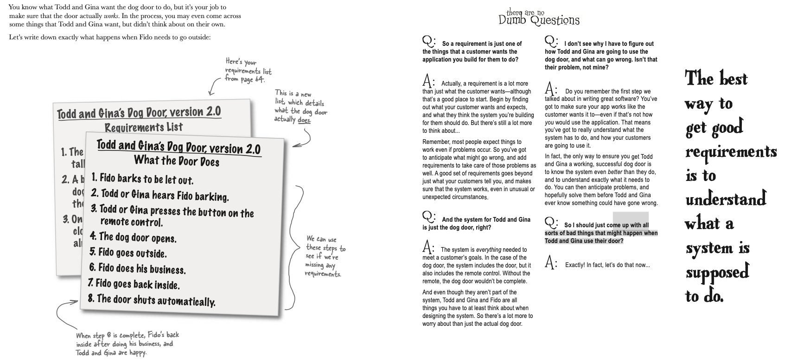

# object-oriented-design-101

## 1 well-designed apps rock

Does the application actually do what it’s supposed to? And what about things like duplicate code—that can’t be good, can it? It’s usually pretty hard to know what you should work on first, and still make sure you don’t screw everything else up in the process.

Here’s the application that the programming firm built for Rick... they’ve put together a system to completely replace all of Rick’s handwritten notes, and help him match his customers with the perfect guitar. Here’s the UML class diagram they gave Rick to show him what they did:


* Invetory.java
* Guitar.java

### But then Rick started losing customers...

It seems like no matter who the customer is and what they like, Rick’s new search program almost always comes up empty when it looks for good guitar matches. But Rick knows he has guitars that these customers would like... so what’s going on?

FindGuitarTester.java

It’s obvious that Rick’s app has problems, but it’s not so obvious what we should work on first. And it looks like there’s no shortage of opinion:


 
The customer-friendly programmer says:

* “Great software always does what the customer wants it to. So even if customers think of new ways to use the software, it doesn’t break or give them unexpected results.”

The object-oriented programmer says:

* “Great software is code that is object-oriented. So there’s not a bunch of duplicate code, and each object pretty much controls its own behavior. It’s also easy to extend because your design is really solid and flexible.”


The design-guru programmer says:

* “Great software is when you use tried-and-true design patterns and principles. You’ve kept your objects loosely coupled, and your code open for extension but closed for modification. That also helps make the code more reusable, so you don’t have to rework everything to use parts of your application over and over again.”


First, great software must satisfy the customer. The software must do what the customer wants it to do

Building software that works right is great, but what about when it’s time to add to your code, or reuse it in another application? It’s not enough to just have software that works like the customer wants it to; your software better be able to stand the test of time.

Second, great software is well-designed, well-coded, and easy to maintain, reuse, and extend.

smart - maintain, reuse and extend.


### Great software in 3 easy steps

1. Make sure your software does what the customer wants it to do.
* This is where getting good requirements and doing some analysis comes in.

2. Apply basic OO principles to add flexibility.
* Once your software works, you can look for any duplicate code that might have slipped in, and make sure you’re using good OO programming techniques.

3. Strive for a maintainable, reusable design.
* It’s time to apply patterns and principles to make sure your software is ready to use for years to come.


Let’s put our ideas about how to write great software to the test and see if they hold up in the real world. Rick’s got a search tool that isn’t working, and it’s your job to fix the application, and turn it into something great. Let’s look back at the app and see what’s going on:

Apply 3 easy steps of great software

step 1 -> If we’re starting with functionality, let’s figure out what’s going on with that broken search() method. It looks like in Rick’s inventory, he’s got “Fender” with a capital “F,” and the customer’s specs have “fender” all lowercase. We just need to do a case-insensitive string comparison in the search() method.

Frank: Sure, that would fix the problem Rick’s having now, but I think there’s probably a better way to make this work than just calling toLowerCase() on a bunch of strings all over the place.

Joe: Yeah, I was thinking the same thing. I mean, all that string comparison seems like a bad idea. Couldn’t we use constants or maybe some enumerated types for the builders and woods?

Jill: You guys are thinking way too far ahead. Step 1 was supposed to be fixing the app so it does what the customer wants it to do. I thought we weren’t supposed to worry about design yet.

Frank: Well, yeah, I get that we’re supposed to focus on the customer. But we can at least be smart about how we fix things, right? I mean, why create problems we’ll have to come back and fix later on if we can avoid them from the start?

Jill: Hmmm... I guess that does make sense. We don’t want our solution to this problem creating new design problems for us down the road. But we’re still not going to mess with the other parts of the application, right?

Frank: Right. We can just remove all those strings, and the string comparisons, to avoid this whole case-matching thing.

Joe: Exactly. If we go with enumerated types, we can ensure that only valid values for the builder, woods, and type of guitar are accepted. That’ll make sure that Rick’s clients actually get to look at guitars that match their preferences.

Jill: And we’ve actually done a little bit of design at the same time... very cool! Let’s put this into action.

Don’t create problems to solve problems.

chose the optimal solution

* Original Java Code Before refactoring :

* Guitar.java
```java
public class Guitar {

    private String serialNumber, builder, model, type, backWood, topWood;
    private double price;

    public Guitar(String serialNumber, double price, String builder, String model, String type, String backWood, String topWood) {
        this.serialNumber = serialNumber;
        this.price = price;
        this.builder = builder;
        this.model = model;
        this.type = type;
        this.backWood = backWood;
        this.topWood = topWood;
    }

    public String getSerialNumber() {
        return serialNumber;
    }

    public double getPrice() { 
        return price;
    }

    public void setPrice(double newPrice) {
        this.price = newPrice;
    }

    public String getBuilder() { 
        return builder;
    }

    public String getModel() {
        return model; 
    }

    public String getType() { 
        return type;
    }

    public String getBackWood() {
        return backWood; 
    }

    public String getTopWood() { 
        return topWood;
    }
}
```


* Inventory.java

```java
import java.util.Iterator;
import java.util.LinkedList;
import java.util.List;

public class Inventory {
    private List guitars;

    public Inventory() {
        guitars = new LinkedList();
    }

    public void addGuitar(String serialNumber, double price, String builder, String model, String type, String backWood, String topWood) {
        Guitar guitar = new Guitar(serialNumber, price, builder, model, type, backWood, topWood);
        guitars.add(guitar);
    } 

    public Guitar getGuitar(String serialNumber) {
        for(Iterator i = guitars.iterator(); i.hasNext(); ) {
            Guitar guitar = (Guitar)i.next();
            if( guitar.getSerialNumber().equals(serialNumber)) {
                return guitar;
            }
        }
        return null;
    }

    public Guitar search(Guitar searchGuitar) {
        for(Iterator i = guitars.iterator(); i.hasNext();) {
            Guitar guitar = (Guitar)i.next();
            // Ignore serial number since that’s unique
            // Ignore price since that’s unique

            String builder = searchGuitar.getBuilder();
            if ((builder != null) && (!builder.equals("")) && (!builder.equals(guitar.getBuilder()))) continue;
            
            String model = searchGuitar.getModel();
            if ((model != null) && (!model.equals("")) && (!model.equals(guitar.getModel()))) continue;
            
            String type = searchGuitar.getType();
            if ((type != null) && (!searchGuitar.equals("")) && (!type.equals(guitar.getType()))) continue;
            
            String backWood = searchGuitar.getBackWood();
            if ((backWood != null) && (!backWood.equals("")) && (!backWood.equals(guitar.getBackWood()))) continue;
            
            String topWood = searchGuitar.getTopWood();
            if ((topWood != null) && (!topWood.equals("")) && (!topWood.equals(guitar.getTopWood()))) continue;
        }
        return null;
    }
}
```

* FindGuitarTester.java 
```java
public class FindGuitarTester {
    public static void main(String[] args) { 
        // Set up Rick’s guitar inventory 
        Inventory inventory = new Inventory(); 
        initializeInventory(inventory);
        Guitar whatErinLikes = new Guitar("", 0, "fender", "Stratocastor", "electric", "Alder", "Alder");
        Guitar guitar = inventory.search(whatErinLikes); 
        
        if (guitar != null) {
            System.out.println("Erin, you might like this " + guitar.getBuilder() + " " + guitar.getModel() + " " + guitar.getType() + " guitar:\n " + 
            guitar.getBackWood() + " back and sides,\n " + guitar.getTopWood() + " top.\nYou can have it for only $" + guitar.getPrice() + "!");
        } else {
            System.out.println("Sorry, Erin, we have nothing for you.");
        } 
    }
        
    private static void initializeInventory(Inventory inventory) { 
        // Add guitars to the inventory...
        inventory.addGuitar("V95693", 1499.95, "Fender", "Stratocastor", "electric", "Alder", "Alder");
    }

}
```

### Ditching String comparisons

The first improvement we can make to Rick’s guitar search tool is getting rid of all those annoying String comparisons. And even though you could use a function like toLowerCase() to avoid problems with uppercase and lowercase letters, let’s avoid String comparisons altogether:

* Builder.java
* Type.java
* Wood.java

One of the big advantages of using enums is that it limits the possible values you can supply to a method... no more misspellings or case issues.

Enums are enumerated types. They’re available in C, C++, Java version 5.0 and up, and will even be a part of Perl 6.

The cool thing about enums is that methods or classes that use them are protected from any values not defined in the enum.
So you can’t misspell or mistype an enum without getting a compiler error. It’s a great way to get not only type safety, but value safety; you can avoid getting bad data for anything that has a standard range or set of legal values.


```java
Guitar whatErinLikes = new Guitar("", 0, Builder.FENDER, "Stratocastor", Type.ELECTRIC, Wood.ALDER, Wood.ALDER);
```

The only String left is for the model, since there really isn’t a limited set of these like there is with builders and wood.

It looks like nothing has changed, but with enums, we don’t have to worry about these comparisons getting screwed up by misspellings or case issues.

```java
String model = searchGuitar.getModel().toLowerCase(); 
if ((model != null) && (!model.equals("")) && (!model.equals(guitar.getModel().toLowerCase()))) continue;
```

The only property that we need to worry about case on is the model, since that’s still a String.


[completed] - 1. Make sure your software does what the customer wants it to do.
Even better, we’ve made Rick’s application less fragile along the way. It’s not going to break so easily now, because we’ve added both type safety and value safety with these enums. That means less problems for Rick, and less maintenance for us.

Code that is not fragile is generally referred to as robust code

So it’s OK to do a little design when I’m working on Step 1, right?

* Yeah, as long as your focus is still on the customer’s needs. You want the basic features of your application in place before you start making big design changes. But while you’re working on functionality, you can certainly use good OO principles and techniques to make sure your application is well designed from the start.

That diagram over on page 18 is a class diagram right? Or is it class diagrams, since it’s more than one class?

* It is a class diagram, and a single diagram can have multiple classes in it. In fact, class diagrams can show a lot more detail than you’ve seen so far, and we’ll be adding to them in the next several chapters.

So we’re ready to move on to Step 2, and start applying OO principles, right?

* Not quite... there’s one more thing Rick would like us to help him with before we’re ready to start analyzing our code for places we might be able to improve it. Remember, our first job is to please the customer, and then we really focus on improving our OO design.


### Rick’s customers want choices!

Rick’s come up with a new requirement for his app: he wants his search tool to return all the guitars that match his client’s specs, not just the first one in his inventory.

```java
inventory.addGuitar("V95693", 1499.95, Builder.FENDER, "Stratocastor", Type.ELECTRIC, Wood.ALDER, Wood.ALDER);
inventory.addGuitar("V9512", 1549.95, Builder.FENDER, "Stratocastor", Type.ELECTRIC, Wood.ALDER, Wood.ALDER);
```


Inventory.java before
```java
public class Inventory {
    private List guitars;

    public Inventory() {
        guitars = new LinkedList();
    }

    public void addGuitar(String serialNumber, double price, Builder builder, String model, Type type, Wood backWood, Wood topWood) {
        Guitar guitar = new Guitar(serialNumber, price, builder, model, type, backWood, topWood);
        guitars.add(guitar);
    } 

    public Guitar getGuitar(String serialNumber) {
        for(Iterator i = guitars.iterator(); i.hasNext(); ) {
            Guitar guitar = (Guitar)i.next();
            if( guitar.getSerialNumber().equals(serialNumber)) {
                return guitar;
            }
        }
        return null;
    }

    public Guitar search(Guitar searchGuitar) {
        for(Iterator i = guitars.iterator(); i.hasNext();) {
            Guitar guitar = (Guitar)i.next();
            // Ignore serial number since that’s unique
            // Ignore price since that’s unique

            Builder builder = searchGuitar.getBuilder();
            if ((builder != null) && (!builder.equals("")) && (!builder.equals(guitar.getBuilder()))) continue;
            
            String model = searchGuitar.getModel().toLowerCase();
            if ((model != null) && (!model.equals("")) && (!model.equals(guitar.getModel().toLowerCase()))) continue;
            
            Type type = searchGuitar.getType();
            if ((type != null) && (!searchGuitar.equals("")) && (!type.equals(guitar.getType()))) continue;
            
            Wood backWood = searchGuitar.getBackWood();
            if ((backWood != null) && (!backWood.equals("")) && (!backWood.equals(guitar.getBackWood()))) continue;
            
            Wood topWood = searchGuitar.getTopWood();
            if ((topWood != null) && (!topWood.equals("")) && (!topWood.equals(guitar.getTopWood()))) continue;
        }
        return null;
    }
}
```

* Inventory.java will be change to return List Search Method.

So I’m not done with the first step until the application works like my customer wants it to?

* Exactly. You want to make sure that the application works like it should before you dive into applying design patterns or trying to do any real restructuring of how the application is put together.

And why is it so important to finish Step 1 before going on to Step 2?

* You’re going to make lots of changes to your software when you’re getting it to work right. Trying to do too much design before you’ve at least got the basic functionality down can end up being a waste, because a lot of the design will change as you’re adding new pieces of functionality to your classes and methods. (Avoid Premature optimization)


You seem sort of hung up on this “Step 1” and “Step 2” business. What if I don’t code my apps that way?

* There’s nothing that says you have to follow these steps exactly, but they do provide an easy path to follow to make sure your software does what it’s supposed to, and is well-designed and easy to reuse. If you’ve got something similar that accomplishes the same goals, that’s great!

### Test drive

We’ve talked a lot about getting the right requirements from the customer, but now we need to make sure we’ve actually got those requirements handled by our code. Let’s test things out, and see if our app is working like Rick wants it to:

FindGuitarTester.java before
```java
public class FindGuitarTester {
    public static void main(String[] args) { 
        // Set up Rick’s guitar inventory 
        Inventory inventory = new Inventory(); 
        initializeInventory(inventory);
        Guitar whatErinLikes = new Guitar("", 0, Builder.FENDER, "Stratocastor", Type.ELECTRIC, Wood.ALDER, Wood.ALDER);
        Guitar guitar = inventory.search(whatErinLikes); 
        
        if (guitar != null) {
            System.out.println("Erin, you might like this " + guitar.getBuilder() + " " + guitar.getModel() + " " + guitar.getType() + " guitar:\n " + 
            guitar.getBackWood() + " back and sides,\n " + guitar.getTopWood() + " top.\nYou can have it for only $" + guitar.getPrice() + "!");
        } else {
            System.out.println("Sorry, Erin, we have nothing for you.");
        } 
    }
        
    private static void initializeInventory(Inventory inventory) { 
        // Add guitars to the inventory...
        inventory.addGuitar("V95693", 1499.95, Builder.FENDER, "Stratocastor", Type.ELECTRIC, Wood.ALDER, Wood.ALDER);
        inventory.addGuitar("V9512", 1549.95, Builder.FENDER, "Stratocastor", Type.ELECTRIC, Wood.ALDER, Wood.ALDER);
    }

}
```

we are goingo to change the FindGuitarTester.java to work with search method that return list

Now that Rick’s all set with our software, we can begin to use some OO principles and make sure the app is flexible and well-designed.

2. Apply basic OO principles to add flexibility

So this is where we can make sure there’s no duplicate code, and all our objects are well designed, right?
Here’s where you take software that works, and make sure the way it’s put together actually makes sense.

### Looking for problems

Let’s dig a little deeper into our search tool, and see if we can find any problems that some simple OO principles might help improve. Let’s start by taking a closer look at how the search() method in Inventory works:


### Analyze the search() method

Let’s spend a little time analyzing exactly what goes on in the search() method of Inventory.java. Before we look at the code, though, let’s think about what this method should do.

The client provides their guitar preferences.

* Each of Rick’s clients has some properties that they’re interested in finding in their ideal guitar: the woods used, or the type of guitar, or a particular builder or model. They provide these preferences to Rick, who feeds them into his inventory search tool.

The search tool looks through Rick’s inventory.

* Once the search tool knows what Rick’s client wants, it starts to loop through each guitar in Rick’s inventory.

Each guitar is compared to the client’s preferences.

* For each guitar in Rick’s inventory, the search tool sees if that guitar matches the client’s preferences. If there’s a match, the matching guitar is added to the list of choices for the client.

Rick’s client is given a list of matching guitars.

* Finally, the list of matching guitars is returned to Rick and his client. The client can make a choice, and Rick can make a sale.


The client can specify only general properties of an instrument. So they never supply a serial number or a price.

Use a textual description of the problem you’re trying to solve to make sure that your design lines up with the intended functionality of your application

### The Mystery of the Mismatched Object Type

objects are very particular about their jobs. Each object is interested in doing its job, and only its job, to the best of its ability. There’s nothing a well-designed object hates more than being used to do something that really isn’t its true purpose.

Unfortunately, it’s come to our attention that this is exactly what is happening in Rick’s inventory search tool: somewhere, an object is being used to do something that it really shouldn’t be doing. It’s your job to solve this mystery and figure out how we can get Rick’s application back in line.

1. Objects should do what their names indicate.

* If an object is named Jet, it should probably takeOff() and land(), but it shouldn’t takeTicket()—that’s the job of another object, and doesn’t belong in Jet.

2. Each object should represent a single concept.

* You don’t want objects serving double or triple duty. Avoid a Duck object that represents a real quacking duck, a yellow plastic duck, and someone dropping their head down to avoid getting hit by a baseball.

3. Unused properties are a dead giveaway.

* If you’ve got an object that is being used with no-value or null properties often, you’ve probably got an object doing more than one job. If you rarely have values for a certain property, why is that property part of the object? Would there be a better object to use with just a subset of those properties?

You know, Rick’s clients really aren’t providing a Guitar object... I mean, they don’t actually give him a guitar to compare against his inventory

Frank: Hey, that’s right, Joe. I hadn’t thought about that before. 

Jill: So what? Using a Guitar object makes it really easy to do comparisons in the search() method.

Joe: Not any more than some other object would. Look:

```java
if (searchGuitar.getBuilder() != guitar.getBuilder()) { continue; }
```

Joe: It really doesn’t matter what type of object we’re using there, as long as we can figure out what specific things Rick’s clients are looking for.

Frank: Yeah, I think we should have a new object that stores just the specs that clients want to send to the search() method. Then they’re not sending an entire Guitar object, which never seemed to make much sense to me.

Jill: But isn’t that going to create some duplicate code? If there’s an object for all the client’s specs, and then the Guitar has all its properties, we’ve got two getBuilder() methods, two getBackWood() methods... that’s not good.

Frank: So why don’t we just encapsulate those properties away from Guitar into a new object?

Joe: Whoa... I was with you until you said “encapsulate.” I thought that was when you made all your variables private, so nobody could use them incorrectly. What’s that got to do with a guitar’s properties?

Frank: Encapsulation is also about breaking your app into logical parts, and then keeping those parts separate. So just like you keep the data in your classes separate from the rest of your app’s behavior, we can keep the generic properties of a guitar separate from the actual Guitar object itself.

Jill: And then Guitar just has a variable pointing to a new object type that stores all its properties?

Frank: Exactly! So we’ve really encapsulated the guitar properties out of Guitar, and put them in their own separate object. Look, we could do something like this...

Encapsulation allows you to hide the inner workings of your application’s parts, but yet make it clear what each part does.

Create the GuitarSpec object.


### Now update your own code

With this class diagram, you should be able to add the GuitarSpec class to your application, and update the Guitar class as well. Go ahead and make any changes you need to Inventory.java so that the search tool compiles, as well.

I understand why we need an object for the client to send specs to search()... but why are we using that object to hold properties for Guitar, too?

Suppose you just used GuitarSpec to hold client specs for sending to the search() method, and you kept the Guitar class just the same as it was. If Rick started carrying 12-string guitars, and wanted a numStrings property, you’d have to add that property—and code for a getNumStrings() method—to both the GuitarSpec and Guitar classes. Can you see how this would lead to duplicate code?

Instead, we can put all that (potentially) duplicate code into the GuitarSpec class, and then have Guitar objects reference an instance of it to avoid any duplication.

Anytime you see duplicate code, look for a place to encapsulate!

I still am confused about how this is a form of encapsulation. Can you explain that again?

The idea behind encapsulation is to protect information in one part of your application from the other parts of your application. In its simplest form, you can protect the data
in your class from the rest of your app by making that data private. But sometimes the information might be an entire
set of properties—like the details about a guitar—or even behavior—like how a particular type of duck flies.

When you break that behavior out from a class, you can change the behavior without the class having to change as well. So if you changed how properties were stored, you wouldn’t have to change your Guitar class at all, because the properties are encapsulated away from Guitar.
That’s the power of encapsulation: by breaking up the different parts of your app, you can change one part without having to change all the other parts. In general, you should encapsulate the parts of your app that might vary away from the parts that will stay the same.

guitar.java file before change
```java
public class Guitar {

    private String serialNumber, model;
    private double price;
    private Builder builder;
    private Type type;
    private Wood backWood, topWood;


    public Guitar(String serialNumber, double price, Builder builder, String model, Type type, Wood backWood, Wood topWood) {
        this.serialNumber = serialNumber;
        this.price = price;
        this.builder = builder;
        this.model = model;
        this.type = type;
        this.backWood = backWood;
        this.topWood = topWood;
    }

    public String getSerialNumber() {
        return serialNumber;
    }

    public double getPrice() { 
        return price;
    }

    public void setPrice(double newPrice) {
        this.price = newPrice;
    }

    public Builder getBuilder() { 
        return builder;
    }

    public String getModel() {
        return model; 
    }

    public Type getType() { 
        return type;
    }

    public Wood getBackWood() {
        return backWood; 
    }

    public Wood getTopWood() { 
        return topWood;
    }
}
```

guitar.java modified and encapsulated to GuitarSpec.java(created).

### update the inventory class

Now that we’ve encapsulated away the specifications of a guitar, we’ll need to make a few other changes to our code.


### Getting ready for another test drive

You’ll need to update the FindGuitarTester class to test out all these new changes:


Encapsulation isn’t the only OO principle I can use at this stage, is it?

Other good OO principles that you might want to think about at this stage are inheritance and polymorphism


But I don’t really see how this encapsulation makes my code more flexible. Can you explain that again?

Once you’ve gotten your software to work like it’s supposed to, flexibility becomes a big deal. What if the customer wants to add new properties or features to the app? If you’ve got tons of duplicate code or confusing inheritance structures in your app, making changes is going to be a pain.

By introducing principles like encapsulation and good class design into your code, it’s easier to make these changes, and your application becomes a lot more flexible.

### Design once, design twice


Once you’ve taken a first pass over your software and applied some basic OO principles, you’re ready to take another look, and this time make sure your software is not only flexible, but easily reused and extended.

3. Strive for a maintainable, reusable design.

Once you’ve applied some basic OO principles, you’re ready to apply some patterns and really focus on reuse.

### Let’s make sure Inventory.java is really well-designed

We’ve already used encapsulation to improve the design of Rick’s search tool, but there are still some places in our code where we could get rid of potential problems. This will make our code easier to extend when Rick comes up with that next new feature he wants in his inventory search tool, and easier to reuse if we want to take just a few parts of the app and use them in other contexts.

Take a look at the class diagram for Rick’s application, and think about what you would need to do to add support for
12-string guitars. What properties and methods would you need to add, and to what classes? And what code would you need to change to allow Rick’s clients to search for 12-strings?

How many classes did you have to modify to make this change? Do you think Rick’s application is well designed right now?


We’re adding a property to GuitarSpec, but we have to change code in the Inventory class’s search() method, as well as in the constructor to the Guitar class.

So that’s the problem, right? We shouldn’t have to change code in Guitar and Inventory to add a new property to the GuitarSpec class. Can’t we just use more encapsulation to fix this?


That’s right—we need to encapsulate the guitar specifications and isolate them from the rest of Rick’s guitar search tool


It’s not enough to know what’s wrong with Rick’s app, or even to figure out that we need some more encapsulation. Now we need to actually figure out how to fix his app so it’s easier to reuse and extend

Adding a new property to GuitarSpec.java results in changes to the code in Guitar.java and Inventory.java. The application should be restructured so that adding properties to GuitarSpec doesn’t affect the code in the rest of the application.

Your task:

* 1. Add a numStrings property and getNumStrings() method to GuitarSpec.java.
* 2. Modify Guitar.java so that the properties of GuitarSpec are encapsulated away from the constructor of the class.
* 3. Change the search() method in Inventory.java to delegate comparing the two GuitarSpec objects to the GuitarSpec class, instead of handling the comparison directly.
* 4. Update FindGuitarTester.java to work with your new classes, and make sure everything still works.
* 5. Compare your answers with ours on page 44, and then get ready for another test drive to see if we’ve finally got this application finished.

You said I should “delegate” comparisons to GuitarSpec. What’s delegation?

Delegation is when an object needs to perform a certain task, and instead of doing that task directly, it asks another object to handle the task (or sometimes just a part of the task).

So in the design puzzle, you want the search() method in Inventory to ask GuitarSpec to tell it if two specs are equal, instead of comparing the two GuitarSpec objects directly within the search() method itself. search() delegates the comparison to GuitarSpec.

And what does delegation have to do with code being more reusable?

Delegation lets each object worry about equality (or some other task) on its own. This means your objects are more independent of each other, or more loosely coupled. Loosely coupled objects can be taken from one app and easily reused in another, because they’re not tightly tied to other objects’ code.

What’s the point of that?

Delegation makes your code more reusable. It also lets each object worry about its own functionality, rather than spreading the code that handles a single object’s behavior all throughout your application

One of the most common examples of delegation in Java is the equals() method. Instead of a method trying to figure out if two objects are equal, it calls equals() on one of the objects and passes in the second object. Then it just gets back a true or false response from the equals() method.


And what does loosely coupled mean again?

Loosely coupled is when the objects in your application each have a specific job to do, and they do only that job. So the functionality of your app is spread out over lots of well-defined objects, which each do a single task really well.


And Why is that good ?

Loosely coupled applications are usually more flexible, and easy to change. Since each object is pretty independent of the other objects, you can make a change to one object’s behavior without having to change all the rest of your objects. So adding new features or functionality becomes a lot easier.

delegation.- The act of one object forwarding an operation to another object, to be performed on
behalf of the first object.

The problem:
Adding a new property to GuitarSpec.java results in changes to the code in Guitar.java and Inventory.java. The application should be refactored so that adding properties to GuitarSpec doesn’t affect the code in the rest of the application.


He just wanted to write great software. So what’s the answer? How do you write great software consistently?

* You just need a set of steps to follow that makes sure your software works and is well designed. It can be as simple as the three steps we used in working on Rick’s app; you just need something that works, and that you can use on all of your software projects

Object-Oriented Analysis & Design helps you write great software, every time

* All this time that we’ve been talking about the three steps you can follow to write great software, we’ve really been talking about OOA&D. OOA&D is really just an approach to writing software that focuses on making sure your code does what it’s supposed to, and that it’s well designed. That means your code is flexible, it’s easy to make changes to it, and it’s maintainable and reusable.

### OOA&D is about writing great software, not doing a bunch of paperwork!


Customers are satisfied when their apps WORK.

* We can get requirements from the customer to make sure that we build them what they ask for. Use cases and diagrams are helpful ways to do that, but it’s all about figuring out what the customer wants the app to do.

Customers are satisfied when their apps KEEP WORKING.

* Nobody is happy when an application that worked yesterday is crashing today. If we design our apps well, then they’re going to be robust, and not break every time a customer uses them in unusual ways. Class and sequence diagrams can help show us design problems, but the point is to write well-designed and robust code.

Customers are satisfied when their apps can be UPGRADED.

* There’s nothing worse than a customer asking for a simple new feature, and being told it’s going to take two weeks and $25,000 to make it happen. Using OO techniques like encapsulation, composition, and delegation will make your applications maintainable and extensible.

Programmers are satisfied when their apps can be REUSED.

* Ever built something for one customer, and realized you could use something almost exactly the same for another customer? If you do just a little bit of analysis on your apps, you can make sure they’re easily reused, by avoiding all sorts of nasty dependencies and associations that you don’t really need. Concepts like the Open-Closed Principle (OCP) and the Single Responsibility Principle (SRP) are big time in helping here.

* Programmers are satisfied when their apps are FLEXIBLE.

Sometimes just a little refactoring can take a good app and turn it into a nice framework that can be used for all sorts of different things. This is where you can begin to move from being a head-down coder and start thinking like a real architect (oh yeah, those guys make a lot more money, too). Big-picture thinking is where it’s at.


This is ALL OOA&D! It’s not about doing silly diagrams... it’s about writing killer applications that leave your customer happy, and you feeling like you’ve kicked major ass.


### Bullet Points

* It takes very little for something to go wrong with an ◆ application that is fragile.
* You can use OO principles like encapsulation and delegation to build applications that are flexible. 
*  Encapsulation is breaking your application into logical parts that have a clear boundary that allows an object to hide its data and methods from other objects. 
* Delegation is giving another object the responsibility of handling a particular task.
* Always begin a project by figuring out what the customer wants.
* Once you’ve got the basic functionality of an app in place, work on refining the design so it’s flexible.
* With a functional and flexible design, you can employ design patterns to improve your design further, and make your app easier to reuse.
* Find the parts of your application that change often, and try and separate them from the parts of your application that don't change.
* Building an application that works well but is poorly designed satisfies the customer but will leave you with pain, suffering, and lots of late nights fixing problems.
* Object oriented analysis and design (OOA&D) provides a way to produce well-designed applications that satisfy both the customer and the programmer.

Funcionality -> Without me, you’ll never actually make the customer happy. No matter how well-designed your application is, I’m the thing that puts a smile on the customer’s face.

Design Paterrn - > I’m all about reuse and making sure you’re not trying to solve a problem that someone else has already figured out.

Encapsulation -> You use me to keep the parts of your code that stay the same separate from the parts that change; then it’s really easy to make changes to your code without breaking everything.

Flexibility -> Use me so that your software can change and grow without constant rework. I keep your application from being fragile.

## 2 gathering requirements 

Give them what they want

Everybody loves a satisfied customer. You already know that the first step in writing great software is making sure it does what the customer wants it to. But how do you figure out what a customer really wants? And how do you make sure that the customer even knows what they really want? That’s where good requirements come in, and in this chapter, you’re going to learn how to satisfy your customer by making sure what you deliver is actually what they asked for.

### You’ve got a new programming gig


### But when Gina tried it...


### So what exactly is a requirement, anyway?


### Creating a requirements list


### what does the dog door really need to do ?



### plan for things going wrong


### Alternate paths handle system problems

A use case is what people call the steps that a system takes to make something happen.


### (Re) introducing use cases

A use case describes what your system does to accomplish a particular customer goal.


### One use case, three parts


### Checking your requirements against your use cases

So far, you’ve got an initial set of requirements and a good solid use case. But now you need to go back to your requirements and make sure that they’ll cover everything your system has to do.
And that’s where the use case comes in:


### So now can we write some code?

With use case and requirements in hand, you’re ready to write code that you know will make Todd and Gina satisfied customers. Let’s check out our requirements and see exactly what we’re going to have to write code for:


### Automatically closing the door

The only requirement left to code is taking care of automatically closing the door after it’s been opened. 

Change on Remote.java class (add timer to close the door)

 Why did you make the timer variable final?

 Because we need to call its cancel() method in the TimerTask anonymous class. If you need to access variables in your anonymous class from the enclosing class (that’s Remote in this case), those variables must be final. And, really, just because it makes things work.

 Why are you calling cancel()? Won’t the timer quit automatically after running the TimerTask?

 t will, but it turns out that most JVMs take forever before they garbage collect the Timer. That ends up hanging the program, and your code will run for hours before it actually quits gracefully. That’s no good, but calling cancel() manually takes care of the problem.


### We need a new simulator!

Our old simulator isn’t that useful anymore... it assumes Todd and Gina are closing the door manually, and not letting the timer do its work. Let’s update our simulator to make it work with the updated Remote class:t

DogDoorSimultor -> change to only press once

### Test drive, version 2.0

we need to test alternate paths as well as the main path.

plan and test for when things go wrong.

### Reviewing the alternate path


change the DogDoorSimultor.java -> add try catch for this alternative path

### Delivering the new dog door

Good use cases, requirements, main paths, alternate paths, and a working simulator; we’re definitely on the road to great software. Let’s take the new dog door to Todd and Gina.


- make use cases


- check that use cases have clear value, start and stop, external initiator

- make requierement from use cases

